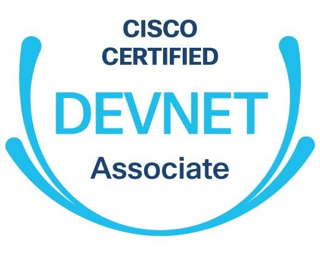
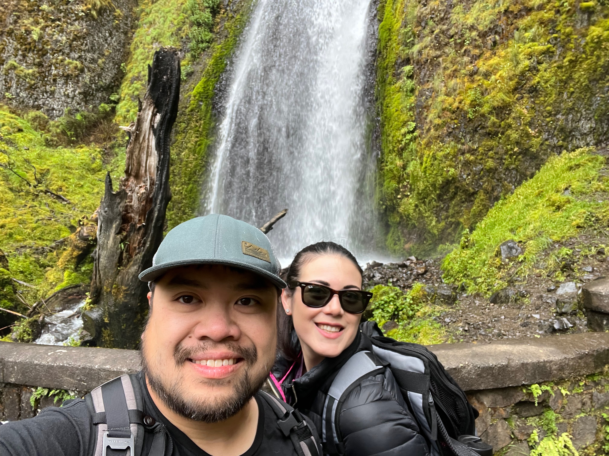
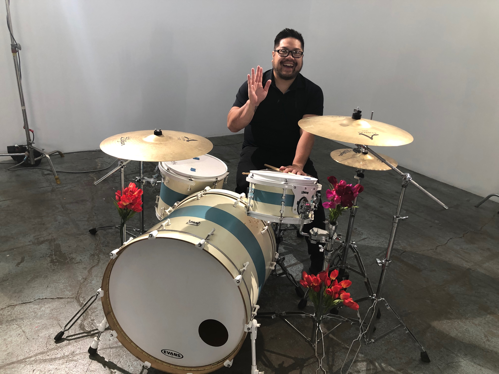

---
## Professional History

I have been an IT professional, specializing in network administration and design for a decade. Here's an abridged story of how I went from a political science major in college to where I am now:

:school: 2005 - 2009: Majored in Political Science at UCLA and worked as an AV Technician for the student Union. 

:musical_note: 2006 - 2010: Toured around the country as a drummer in a band, where I obtained certain skills that would come in handy later in life. Some of the skills included building a social network in the music industry, face to face sales at malls (soliciting our album), and audio visual engineering (live sound and recording). 

:computer: 2011 - 2013: Learned the true value of a degree in political science :poop: This meant that I had to leverage my experience as a former college AV tech, as well as the skills I gained as a touring musician to obtain a job in corporate AV support. During my time as a corpoate AV support tech, I learned how to become an IT systems administrator, configuring and troubleshooting media servers, network switches, and end user machines. I eventually landed a job as a contractor at Google, which was a big milestone for me as an IT professional.

:signal_strength: 2014 - Present: I got a job at Coursea, where I was able to dive into network administration. This is where I decided to stick with network engineering as a long-term career path. I became a CCNA, worked in network operations for a few more years at a couple more companies - Cisco Meraki, Roche, and Stitch Fix. This experience lead to my current position as a pre-sales Solutions Engineer at Cisco Meraki

--- 
## Skills and Technology

<strong>Cisco Technologies</strong> - Where I gained knowledge and experience Routing, Switching, Wireless, Security, IoT 

<strong>Linux Administration</strong> - general systems administration for distributions like debian and ubuntu, and shell scripting

<strong>Windows Administration</strong> - general Windows systems administration, powershell, and Active Directory 

<strong>Python</strong> - Language I use for network automation scripts.

<strong>Postman</strong> - Tool I use for testing API endpoints.

<strong>Visual Studio Code</strong> - My IDE of choice.

<strong>Git</strong> - What I use to version control my projects. For example, managing the repo for this Hugo site.

<strong>Github</strong> - Where I store all of my project repositories.

<strong>Terraform</strong> - The automation tool I like to use to deploy infrastructure.

<strong>AWS</strong> - One of the cloud providers I have experience with.

<strong>Azure</strong> - The other cloud provider I have experience with.

## Certifications

<table>
    <thead>
        <tr>
            <th>Logo</th>
            <th>Name</th>
            <th>Date</th>
        </tr>
    </thead>
    <tbody>
        <tr>
            <td  style="vertical-align: middle !important;" rowspan=1></td>
            <td  style="vertical-align: middle !important;" rowspan=1><a href="https://cp.certmetrics.com/cisco/en/public/verify/credential/5EFD2EGHFL1Q1PWQ" target="_blank">Cisco Certified Network Associate (CCNA)</a></td>
            <td  style="vertical-align: middle !important;" rowspan=1>Cert ID: 5EFD2EGHFL1Q1PWQ</td>
            <td style="vertical-align: middle !important;" >Expires 2027</td>
        </tr>
        <tr>
            <td style="vertical-align: middle !important;"  rowspan=1></td>
            <td  style="vertical-align: middle !important;" rowspan=1><a href="https://cp.certmetrics.com/cisco/en/public/verify/credential/WKE1CF0P3GVE1554" target="_blank">Cisco Certified DevNet Associate</a></td>
            <td  style="vertical-align: middle !important;" rowspan=1>Cert ID: WKE1CF0P3GVE1554</td>
            <td style="vertical-align: middle !important;" >Expires 2027</td>
        </tr>
         <tr>
            <td style="vertical-align: middle !important;"  rowspan=1></td>
            <td  style="vertical-align: middle !important;" rowspan=1><a href="https://www.cwnp.com/certifications/verify-cwnp" target="_blank">Certified Wireless Network Administrator</a></td>
            <td  style="vertical-align: middle !important;" rowspan=1>Cert ID: 672793</td>
            <td style="vertical-align: middle !important;" >Expires 2027</td>
        </tr>
    </tbody>
</table>

---

## Personal Life

My family and I love going on outdoor adventures. Not including the newest addition to the family for safety reasons.

I'm an avid mountain biker and I love traveling with the purpose of exploring new trails.

I've been a drummer for a couple of decades and used to be in a touring band.
