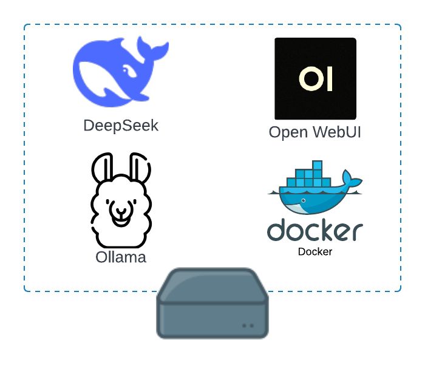
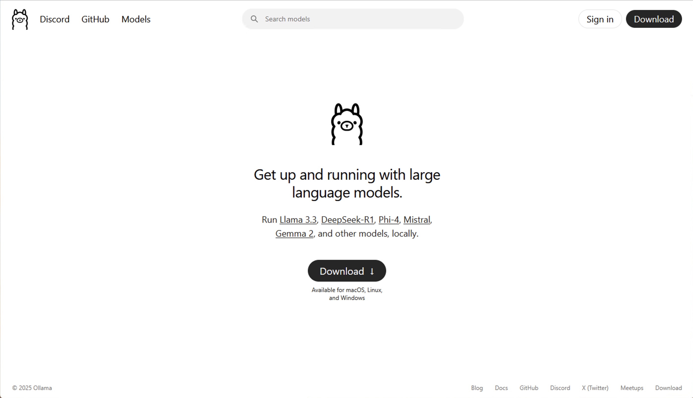
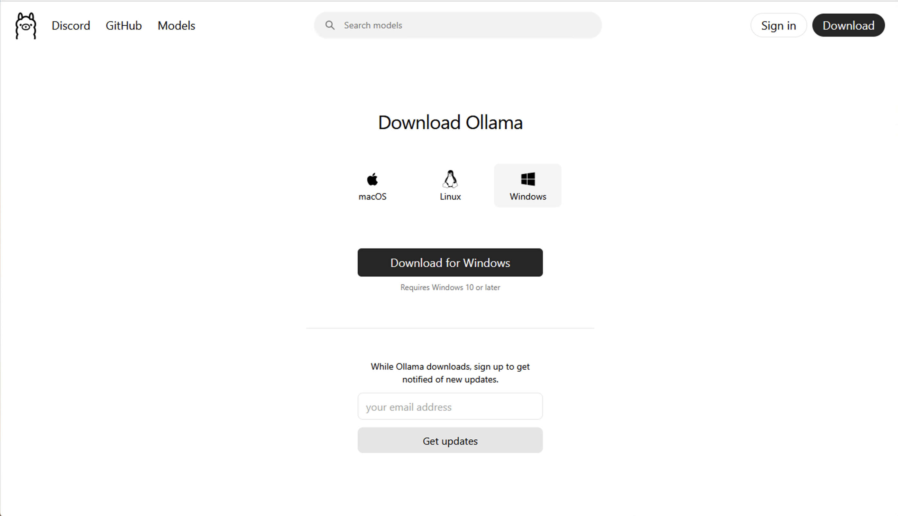
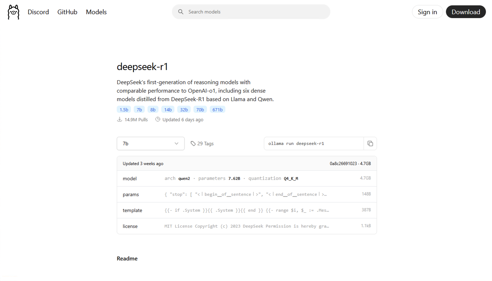
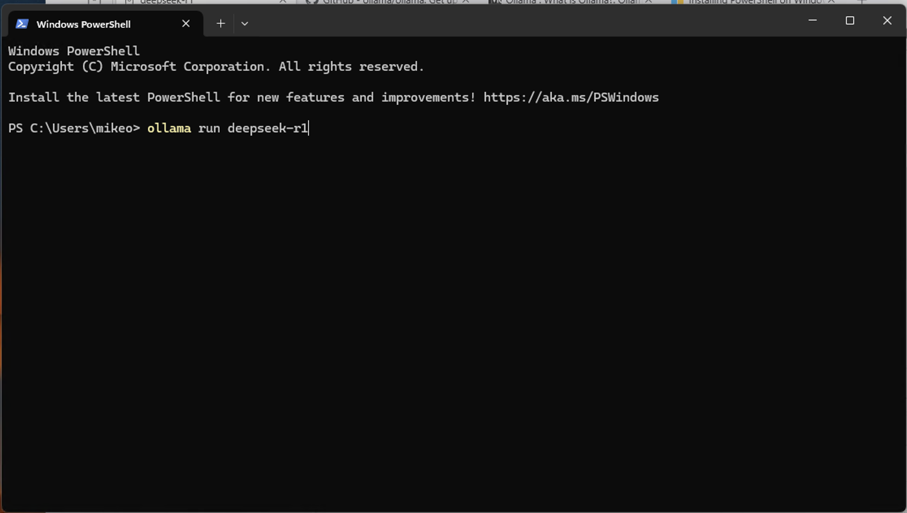
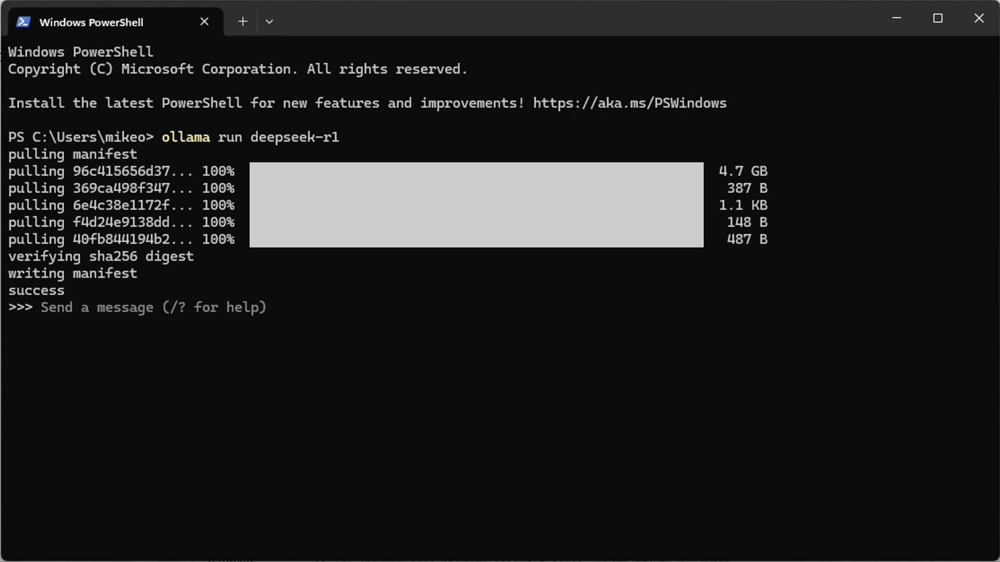
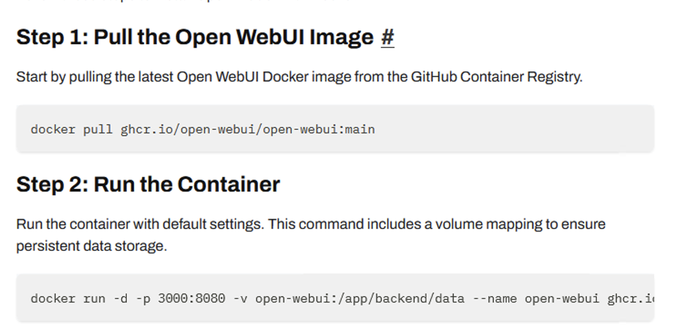

This is a quick tutorial on how to deploy DeepSeek on a local machine. I'm running this on Windows, but you can run it on MacOS or Linux

## Download Ollama

Ollama is an open-source project that serves as a powerful and user-friendly platform for running LLMs on your local machine. 

Navigate to https://ollama.com

Download Ollama

Once downloaded, locate the executable and run through the install prompts to complete the installation.

## Running DeepSeek r1

From the <a href = "https://ollama.com"> Ollama </a> webpage, navigate to <a href = "https://ollama.com/search"> Models</a> and click on <a href = "https://ollama.com/library/deepseek-r1"> deepseek-r1 </a>

Since we do not have an expensive AI server, we will be using the 7 billion parameter version. 

*For more information on LLM sizes, you refer to this <a href = "https://web.dev/articles/llm-sizes"> article </a>*

Copy the command from the website: 

`ollama run deepseek-r1`

Open PowerShell and run the command:

Once the download is complete, the UI should look like this:

You will now issue your prompts from the CLI. 

## Configuring a UI for DeepSeek

We will now use Docker to run our fancy LLM UI. 

Download and install <a href = "https://docker.com"> docker </a>. Make sure to set up Docker Desktop. 

Navigate to this page to <a href = "https://docs.openwebui.com/getting-started/quick-start/"> openwebui page </a> for the relevant docker command. 

Follow the steps:

