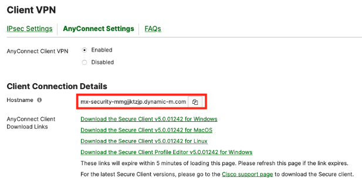
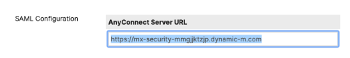
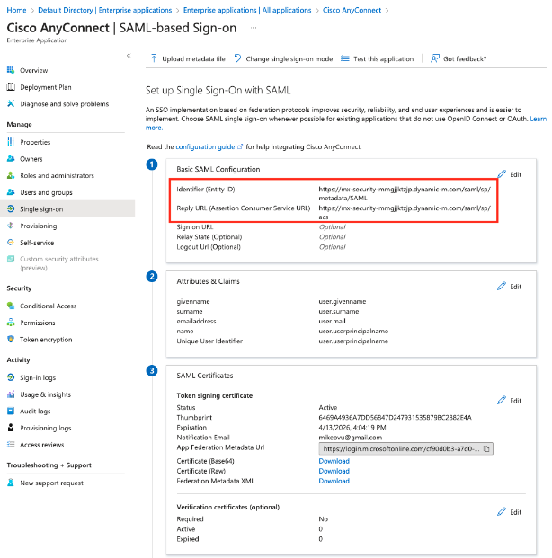
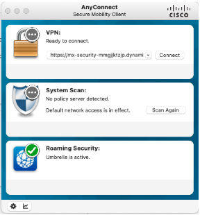
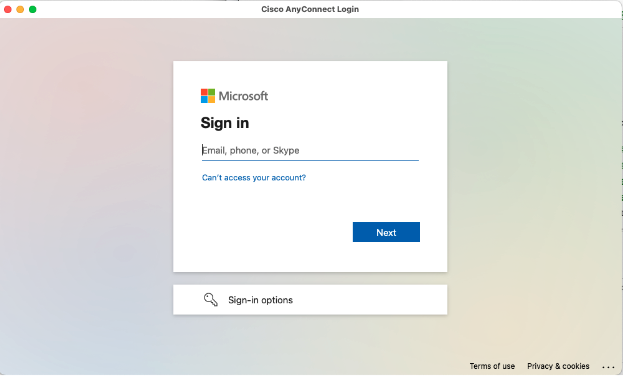

## Configuration steps on AzureAD and Meraki Dashboards

*This guide seems redundant, but there are some quirks that are not accounted for in the official Meraki documentation. I've included details to help avoid confusion during the configuration process*

1. Follow the steps in Meraki's <a href="https://documentation.meraki.com/MX/Client_VPN/AnyConnect_on_the_MX_Appliance/AnyConnect_Azure_AD_SAML_Configuration">AnyConnect Azure AD SAML Configuration document.</a> and stop at *Step 7*.

2. Before you start *Step 7*, navigate to your Meraki Dashboard and navigate to the *Security & SD-WAN > Configure> Client VPN* page. 

3. Click on `AnyConnect Settings` and select `Enabled`. 

4. Copy your hostname to your clipboard under the `Client Connection Details` page:



5. Navigate back to *Step 7* of the <a href="https://documentation.meraki.com/MX/Client_VPN/AnyConnect_on_the_MX_Appliance/AnyConnect_Azure_AD_SAML_Configuration">AnyConnect Azure AD SAML Configuration document.</a> and follow the formatting instructions, using your hostname. 

```
mx-security-mmgjjktzjp.dynamic-m.com/saml/sp/metadata/SAML
mx-security-mmgjjktzjp.dynamic-m.com/saml/sp/acs
```

6. When you get to *Step 9* of the document, make sure you add the hostname with `https://` in front of it in the `AnyConnect Server URL field`:



7. Navigate back to the AzureAD portal and click on the `Single Sign-on menu`.


8. Check the `Basic SAML Configuration` box to ensure you’ve entered the correct hostname in the `Identifier (Entity ID)` and `Reply URL (Assertion Consumer Service URL)` fields:



9. Give AzureAD at least 30 minutes to accept the configuration. When I tested this, authentication kept failing within the first 30 minutes. After 30 minutes, I was able to authenticate without changing any settings.

## Test Client VPN on your End Device

If you did not set up an <a href = "https://documentation.meraki.com/MX/Client_VPN/AnyConnect_on_the_MX_Appliance/Client_deployment">AnyConnect Profile</a> for your end devices yet, follow the subsequent steps:

1. Open the `AnyConnect Secure Mobility Client` on your machine:


2. Copy and paste the `AnyConnect Server URL into the` `VPN` field.


3. When you press Connect, a Microsoft popup window will appear and prompt you to login using your credentials.






