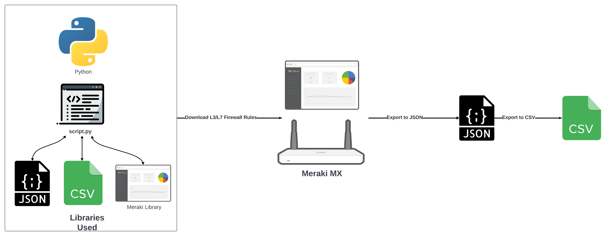
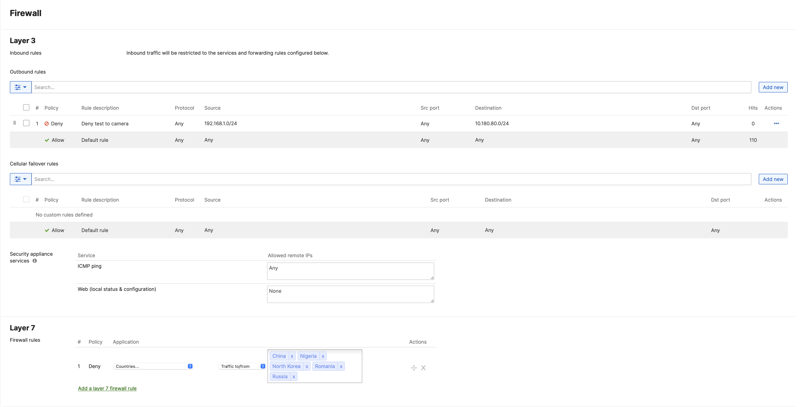
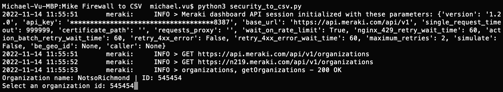
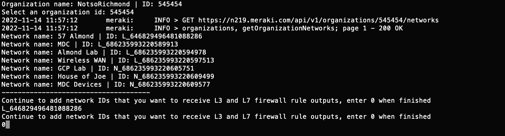
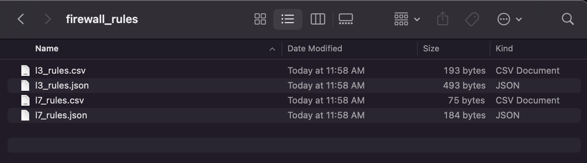
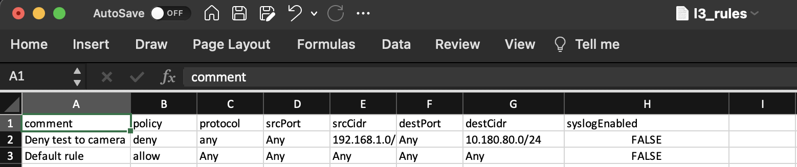
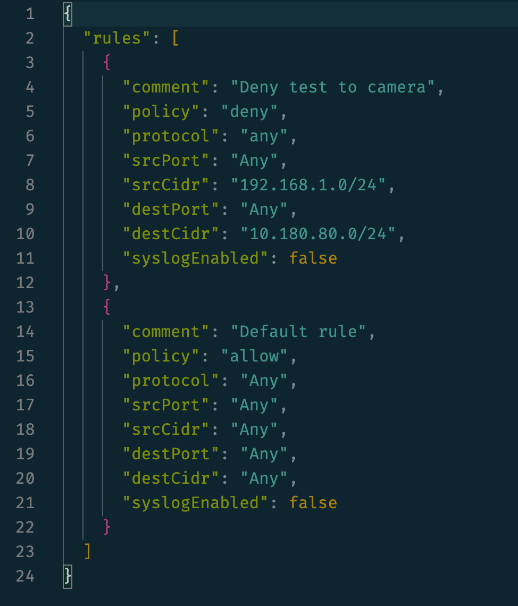
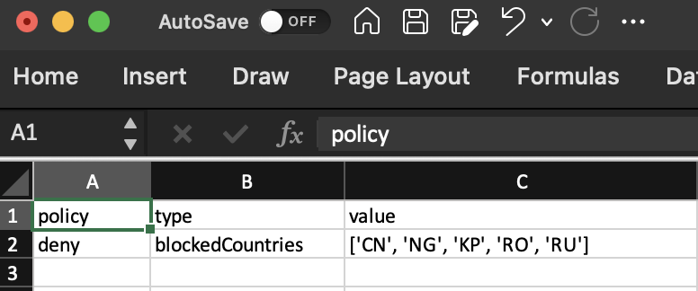
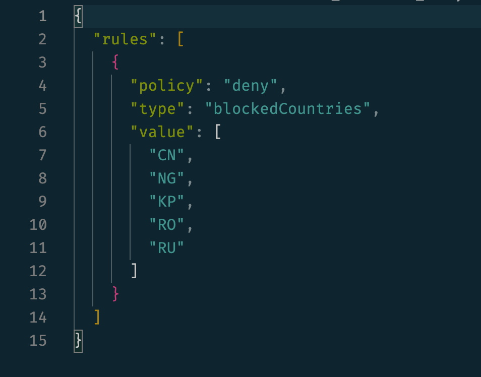

This tutorial will guide you through the process of using Python to download the Layer 3 and Layer 7 rules from a Meraki MX into a CSV spreadsheet. 


# What you Need

<a href = "https://documentation.meraki.com/General_Administration/Organizations_and_Networks/Creating_a_Dashboard_Account_and_Organization">Access to the Meraki Dashboard</a>

<a href = "https://documentation.meraki.com/MX/MX_Sizing_Information/MX_Sizing_Principles">A Meraki MX Appliance</a>

<a href = "https://documentation.meraki.com/General_Administration/Other_Topics/Cisco_Meraki_Dashboard_API#Generate_API_Key">Meraki API Key</a>

*BEFORE PROCEEDING, GENERATE YOUR API KEY AND SAVE IT SOMEWHERE SECURE*

## GitHub Repo

You can either download the files from my <a href ="https://github.com/mikeovu/Meraki_Firewall_Rules_to_CSV.git"> Github</a>

or clone the repo:

```
git clone https://github.com/mikeovu/Meraki_Firewall_Rules_to_CSV.git

```
## Python Script 

Here is the Python code that takes the firewall rules from the Meraki Dashboard and converts it into JSON --> CSV. 

Do NOT run the code yet. Review it and then proceed to the Installation/Configuration section below

In the repo, it's named `security_to_csv.py`:

```
import meraki
import json
import config
import csv

dashboard = meraki.DashboardAPI(config.api_key,single_request_timeout=999999)

# Uses the Meraki library to grab Organization info.
orgs = dashboard.organizations.getOrganizations()

# Displays the org name and ID 
for org in orgs:
    print("Organization name: " + str(org["name"]) + " | " + "ID: " + str(org["id"]))

# Prompts user to select Organization ID

org_id = input("Select an organization id: ")

# Displays dashboard orrganization mapped to organization ID
networks = dashboard.organizations.getOrganizationNetworks(organizationId=org_id)

# Displays all networks in the organization the user has selected

for network in networks:
    print("Network name: " + str(network["name"]) + " | " + "ID: " + str(network["id"]))

print("-------------------------------------")
breaker = "1"
networks_to_output = []

# Promps user to specify network ids that they would like to see

while breaker == "1":
    net_id = input("Continue to add network IDs that you want to receive L3 and L7 firewall rule outputs, enter 0 when finished\n")

    if net_id == "0":
        breaker = "0"
        break

    networks_to_output.append(net_id)

confirmation = input("press y to proceed ")

# Iterates through L7 rules of chosen network and creates a json file containing l7 policies

for network in networks_to_output:
    with open('firewall_rules/l7_rules.json', 'w') as f:
        output_l7_response = dashboard.appliance.getNetworkApplianceFirewallL7FirewallRules(networkId=network)
        json.dump(output_l7_response, f, indent=2)

# Iterates through L3 rules of chosen network and creates a json file containing L3 policies

for network in networks_to_output:
    with open('firewall_rules/l3_rules.json', 'w') as f:
        output_l3_response = dashboard.appliance.getNetworkApplianceFirewallL3FirewallRules(networkId=network)
        json.dump(output_l3_response, f, indent=2)


# Convert L7_rules.json to csv

with open('firewall_rules/l7_rules.json') as l7_rules:
    l7_policies = json.load(l7_rules)

policies = l7_policies['rules']

# Open csv for writing l7 rules

rule_data = open('firewall_rules/l7_rules.csv', 'w')

# create the csv writer object
csv_writer = csv.writer(rule_data)

# Counter variable used for writing
# headers to the csv file

count = 0

for rule in policies:
    if count == 0:

# Writing headers of CSV file
        header = rule.keys()
        csv_writer.writerow(header)
        count += 1

# Writing data of CSV file
    csv_writer.writerow(rule.values())

l7_rules.close()

# Convert L3_rules.json to csv

with open('firewall_rules/l3_rules.json') as l3_rules:
    l3_policies = json.load(l3_rules)

policies = l3_policies['rules']

# Open csv for writing l7 rules

rule_data = open('firewall_rules/l3_rules.csv', 'w')

# create the csv writer object
csv_writer = csv.writer(rule_data)

# Counter variable used for writing
# headers to the csv file

count = 0

for rule in policies:
    if count == 0:

# Writing headers of CSV file
        header = rule.keys()
        csv_writer.writerow(header)
        count += 1

# Writing data of CSV file
    csv_writer.writerow(rule.values())

l3_rules.close()

```
## MX firewall rules you will be outputting to JSON and CSV

Here are the firewall rules specified in the `Layer 3` and `Layer 7` sections of the **Security & SD-WAN > Configure > Firewall** menu in the dashboard.



## Installation/Configuration


1. Open the `config.py` file from the repository and paste in your Meraki API Key.


```python
    api_key=""

```

2. install the dependencies required for the python script

```console
~$ pip install -r requirements.txt
```

3. run the python script

```console
~$ python3 security_to_csv.py
```

4. You will be asked to specify the Dashboard Organization you will be requesting firewall rules from.



5. You will be asked to specify the network you will be requesting firewall rules from.




## Firewall Rules Directory



## L3 Firewall Rules CSV & JSON





## L7 Firewall Rules CSV & JSON





