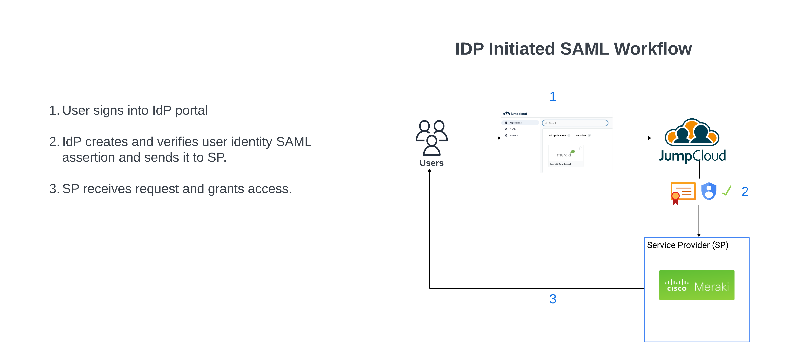

## Summary

In this guide, I will walk you through how I configured Single Sign-On to my Meraki Dashboard using JumpCloud as the Identity Provider.

## High-Level Diagram

---
This is a simple diagram that illustrates how IdP-initiated SSO works. JumpCloud is the IdP I chose because of their 30 day free trial program and ease of use.

For now, Meraki is the only SSO app I have configured. Eventually, I will add apps like Azure and AWS.

Like most identity management providers, JumpCloud uses SAML 2.0 to facilitate SSO. 

