## How to Set Up an AWS EC2 as a SOCKS5 Proxy

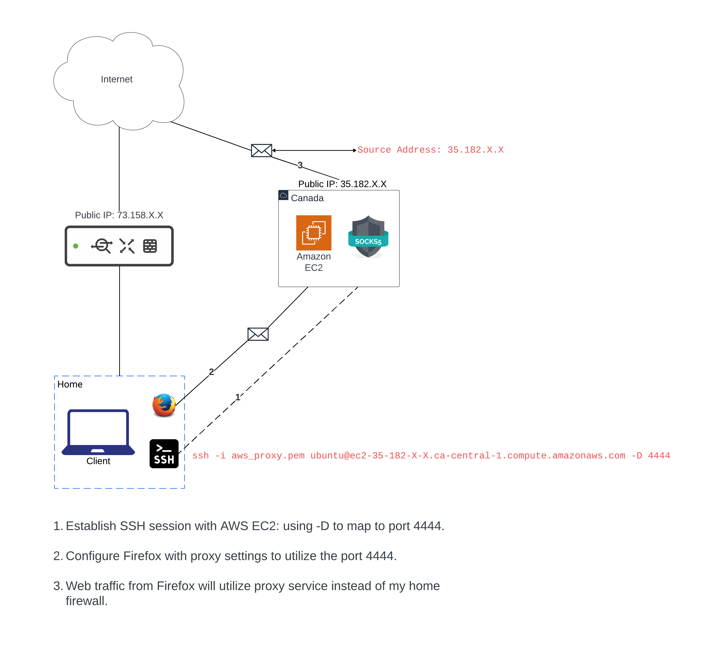

## Summary

This guide will walk you through how to configure an Amazon EC2 as a SOCKS5 proxy. 

You will then be able to establish an SSH session to the proxy from your computer and tunnel internet traffic through the proxy. This will change the source IP of your outgoing traffic (NAT). 

## Pre-requisites

- Computer
- AWS account
- Some command line knowledge

## Configuration Steps

1. Sign-in to your <a href = "https://aws.amazon.com/console/">AWS account</a>

2. Navigate to `Services > EC2`

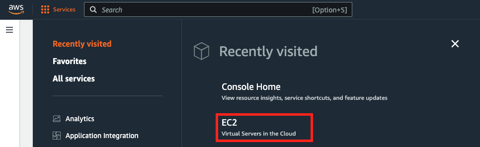

3. Click on `Launch Instance`

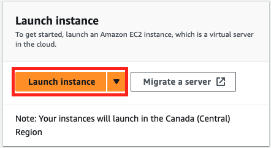

4. Name your instance, select `Ubuntu` and choose the `Free tier elibible AMI - t2.micro`

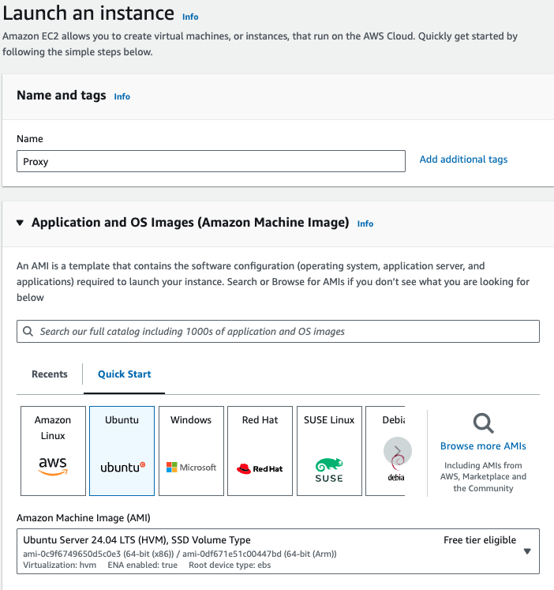

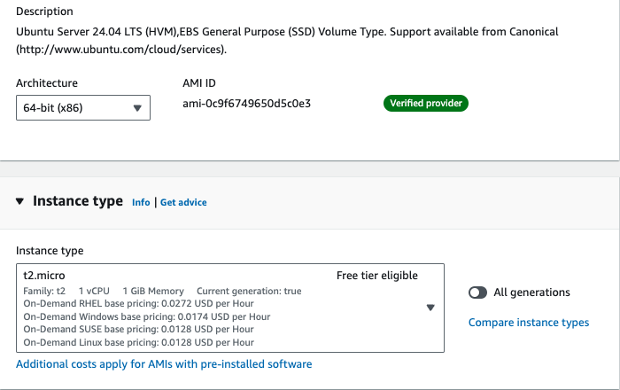

5. Click on `Create new key pair` to generate the SSH keys for your instance.

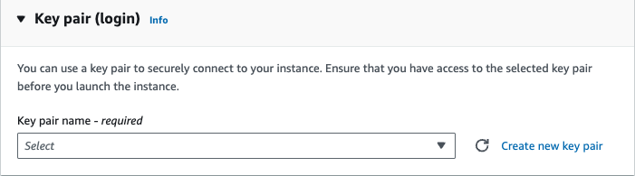

6. Choose a name for it and click on `Create key pair`

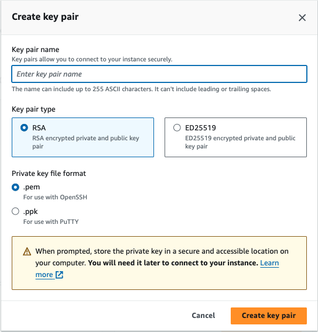

This keypair will allow you to SSH into your instance from your computer. To learn more about how asymmetric encryption works, read through this <a href="https://cloud.google.com/kms/docs/asymmetric-encryption#:~:text=Asymmetric%20encryption%20is%20the%20process,known%20as%20public%20key%20cryptography.">article</a>

7. In the Network settings, I recommend you only allow SSH access from your own public IP. 

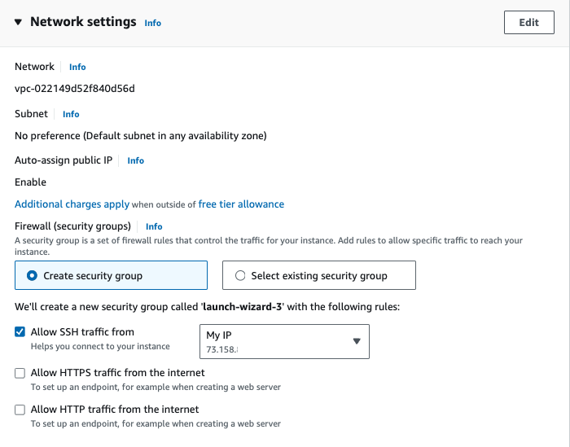

8. Leave all of the other settings as default and click `Launch instance`. 

9. You can navigate to `EC2 > Instances` and wait for you instance to transition to a running state. Click on the instance id to view details. 

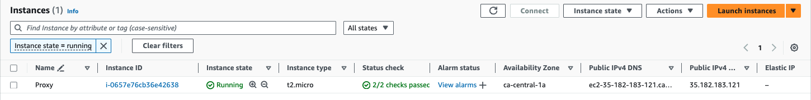

10. From the Instance Summary page, make note of your public IP - this will be the new source IP that will appear to any destination server you request resources from. You should also copy the `Public IPv4 DNS` address to your clipboard and paste it somewhere you can reference later.

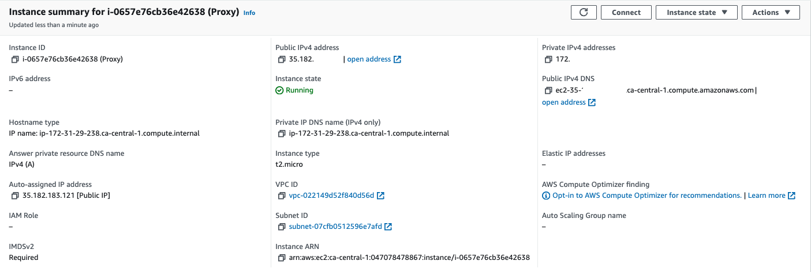

11. Go to your computer and copy your downloaded SSH keypair into the destination of your choice. I chose to move the ssh keys from the Downloads directory to my `~/.ssh/` directory. I used this command: `mv Downloads/aws_proxy.pem ~/.ssh`

12. If you haven't already, you can also generate your own SSH keys to copy to the new EC2 instance you created to make connection to your instance faster: 

Generate your SSH keys: `ssh-keygen -b 4096 -t rsa`

Follow the prompts to save your keys in the `~/.ssh` directory. 

13. Copy the Public DNS address of your EC2 instance you saved earlier and enter the following command to SSH into your new instance.

`ssh -i aws_proxy.pem ubuntu@your_public_dns -D 4444`

The default hostname is `ubuntu`

Make sure to add your public DNS address after `@`

`4444` is an ephemeral port you will use for the web socket. 

## Send traffic through the proxy

1. Open Firefox and go to settings. 

2. Find the Proxy settings

3. Click on `Settings`

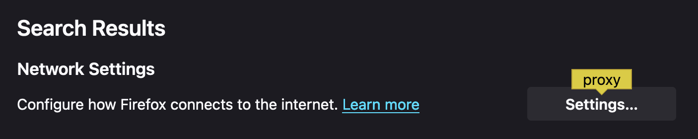

4. Specify `Manual proxy configuration`

Leave the SOCKS Host as your `localhost` and specify port `4444`. 

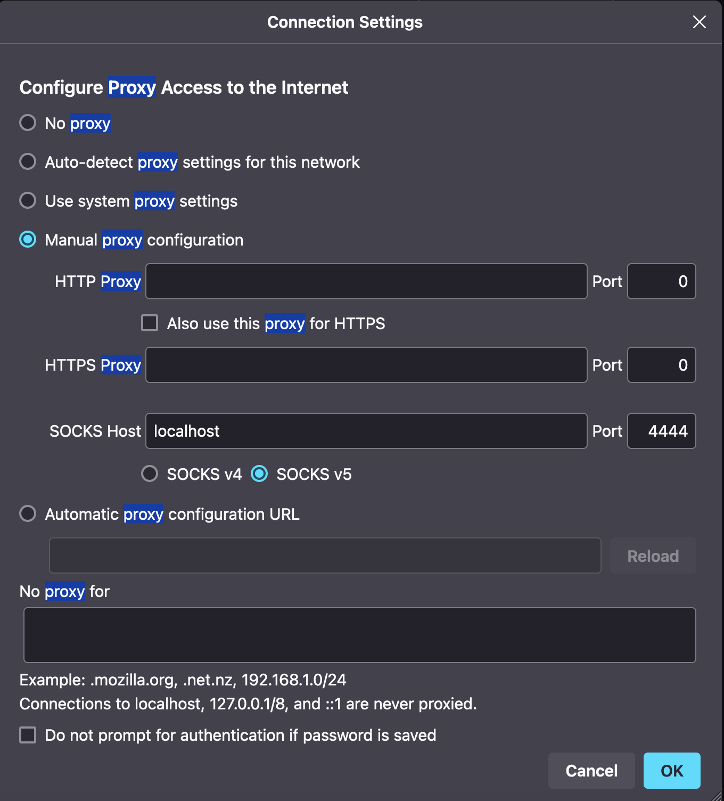

5. Now you can navigate to any site using Firefox and the site you're trying to reach will see the public IP of your EC2 instance. 

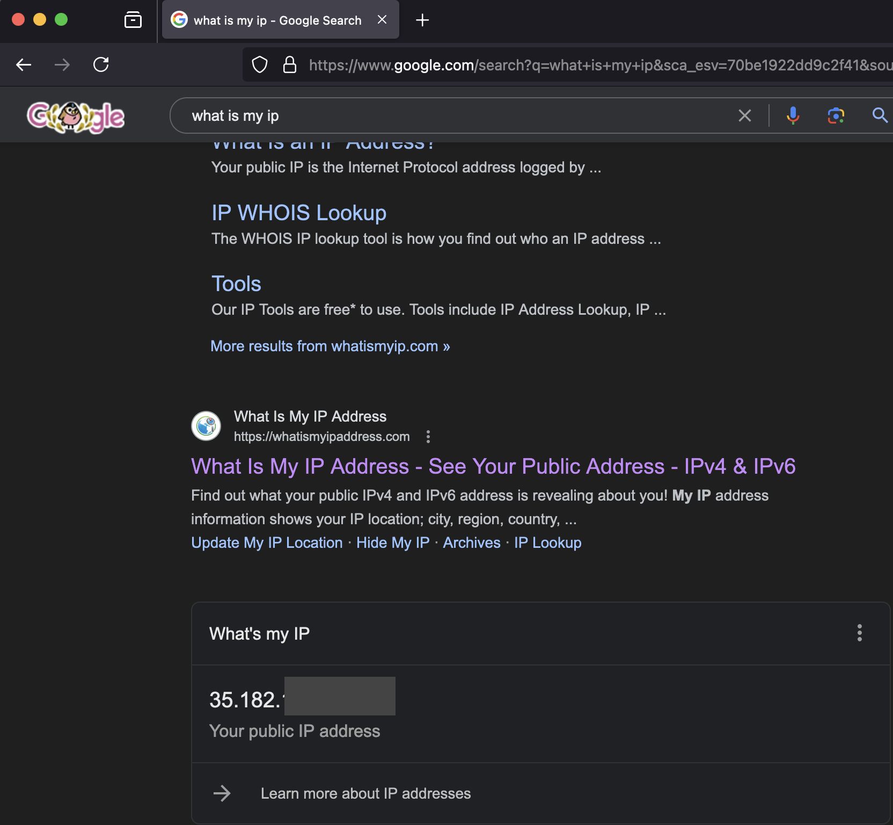

