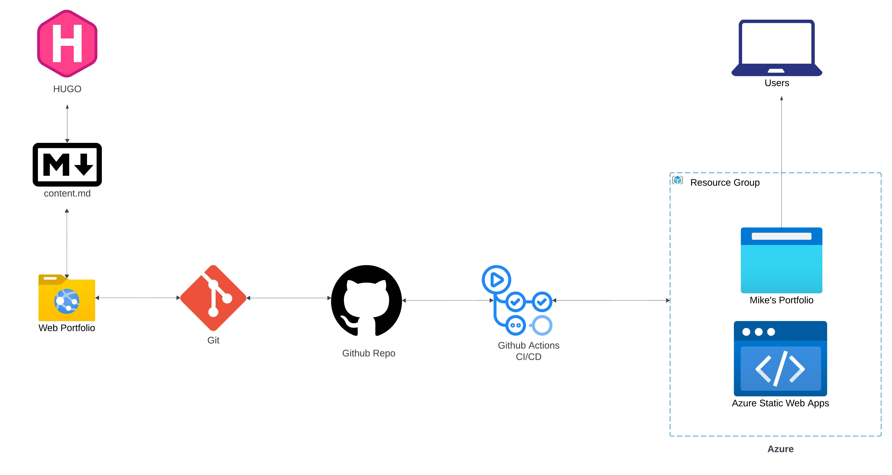
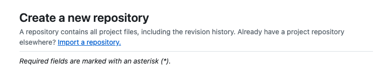
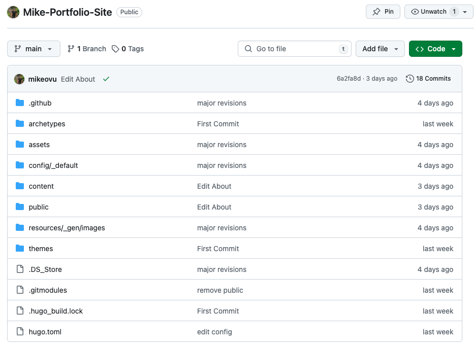
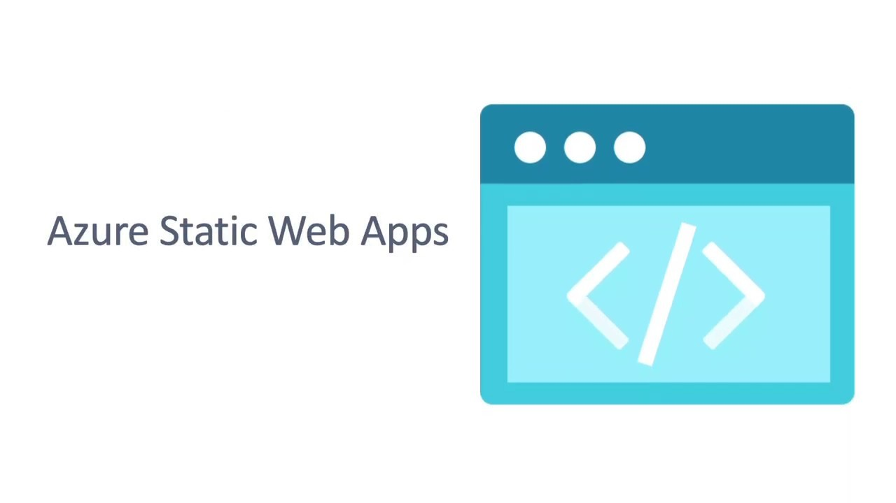

This is a high-level guide meant to describe how I created and deployed my static portfolio site. I've included links to resources you can use to create your own static site. 


## Create a Repo for your site in Github

To learn how to create your own repo, follow this <a href = "https://docs.github.com/en/repositories/creating-and-managing-repositories/quickstart-for-repositories">guide</a>

I created my site's repo.






## Downloading, Installing, and Using Hugo

<a href = "https://gohugo.io/"> Hugo</a> is a web framework for building static sites. 


It's a great tool for people that don't have the patience for traditional web design. 

They have a ton of <a href = "https://themes.gohugo.io/">themes</a> to choose from. 

I used the <a href = "https://blowfish.page/docs/getting-started/">blowfish</a> theme. 


Each theme has its own methods and techniques for customizing and generating content. I spent a lot of time on the <a href = "https://blowfish.page/docs/">blowfish docs</a> to learn. 

**Why I used Hugo?**

I used Hugo because it allows you to generate content pages using <a href="https://www.markdownguide.org/getting-started/">`Markdown`.</a>

## Use Git for version control

I used <a href="https://www.atlassian.com/git/tutorials/what-is-git">`Git`</a> as my version control tool of choice. 

Needless to say, this keeps everything in sync between my local machine and remote repository.

Here's the <a href = "https://www.git-scm.com/docs">official reference page</a> for `Git`. 


## Shipping my Site Using Azure Static Web Apps


**Microsoft Azure has a Service called <a href="https://azure.microsoft.com/en-us/products/app-service/static">Static Web Apps</a>**



It automatically sync's with your site's Github repo and maintains CI/CD via Github actions.

I followed Microsoft's <a href = "https://learn.microsoft.com/en-us/azure/static-web-apps/get-started-portal?tabs=vanilla-javascript&pivots=github">official documentation</a> to learn how to host my site. 

For CI/CD, Azure uses Github Actions. Here is the `YAML` workflow file that it uses: 

```
name: Azure Static Web Apps CI/CD

on:
  push:
    branches:
      - main
  pull_request:
    types: [opened, synchronize, reopened, closed]
    branches:
      - main

jobs:
  build_and_deploy_job:
    if: github.event_name == 'push' || (github.event_name == 'pull_request' && github.event.action != 'closed')
    runs-on: ubuntu-latest
    name: Build and Deploy Job
    steps:
      - uses: actions/checkout@v3
        with:
          submodules: true
          lfs: false
      - name: Build And Deploy
        id: builddeploy
        uses: Azure/static-web-apps-deploy@v1
        with:
          azure_static_web_apps_api_token: ${{ secrets.AZURE_STATIC_WEB_APPS_API_TOKEN_AMBITIOUS_TREE_075E10E10 }}
          repo_token: ${{ secrets.GITHUB_TOKEN }} # Used for Github integrations (i.e. PR comments)
          action: "upload"
          ###### Repository/Build Configurations - These values can be configured to match your app requirements. ######
          # For more information regarding Static Web App workflow configurations, please visit: https://aka.ms/swaworkflowconfig
          app_location: "/" # App source code path
          api_location: "" # Api source code path - optional
          output_location: "public" # Built app content directory - optional
          ###### End of Repository/Build Configurations ######

  close_pull_request_job:
    if: github.event_name == 'pull_request' && github.event.action == 'closed'
    runs-on: ubuntu-latest
    name: Close Pull Request Job
    steps:
      - name: Close Pull Request
        id: closepullrequest
        uses: Azure/static-web-apps-deploy@v1
        with:
          azure_static_web_apps_api_token: ${{ secrets.AZURE_STATIC_WEB_APPS_API_TOKEN_AMBITIOUS_TREE_075E10E10 }}
          action: "close"
```

Any time you run a `git push` from your local repo, the changes will automatically update your shipped site.

